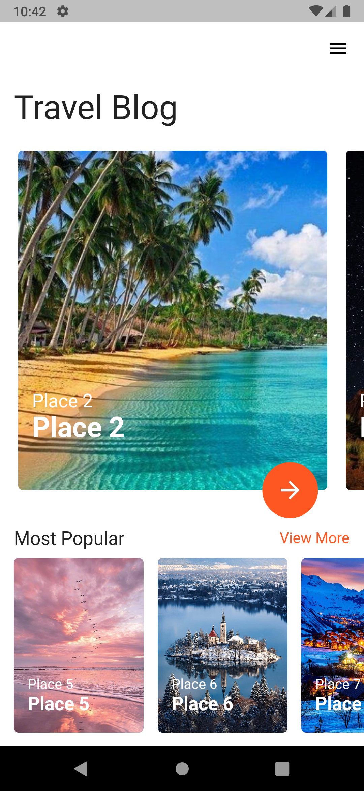

# Flutter_Travel_Blog_UI
Ui design of a Travel Blog app. Home screen and details screen.

<a href="">Download and tryout the app</a>

</img>

<strong>Fig 1: Home Screen.</strong>

  

</img>

<strong>Fig 2: Details Screen.</strong>

  
